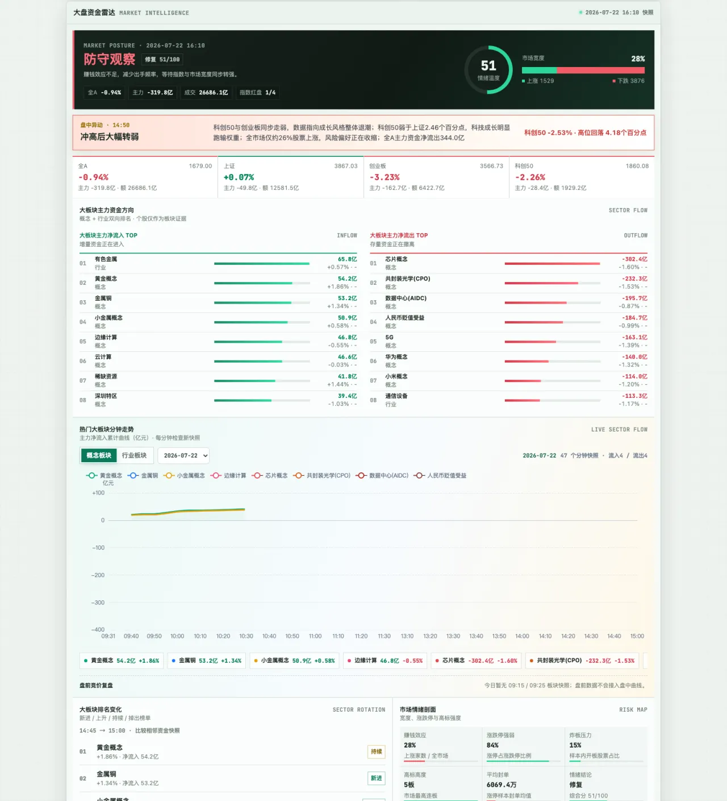
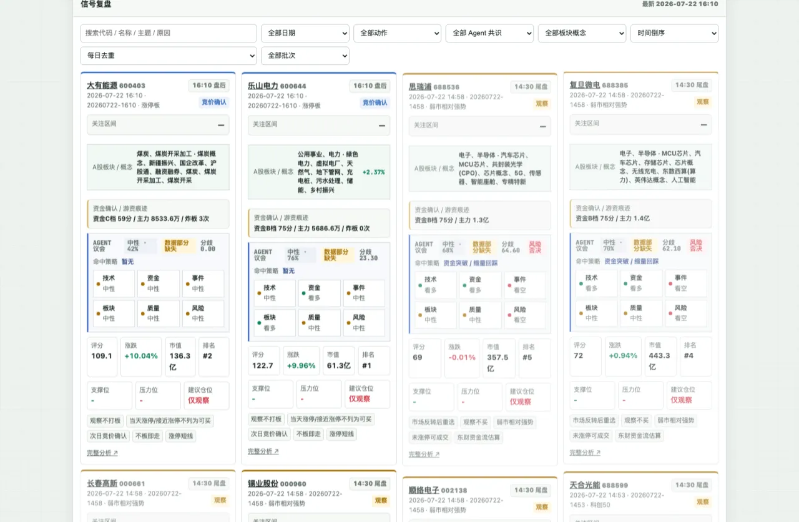
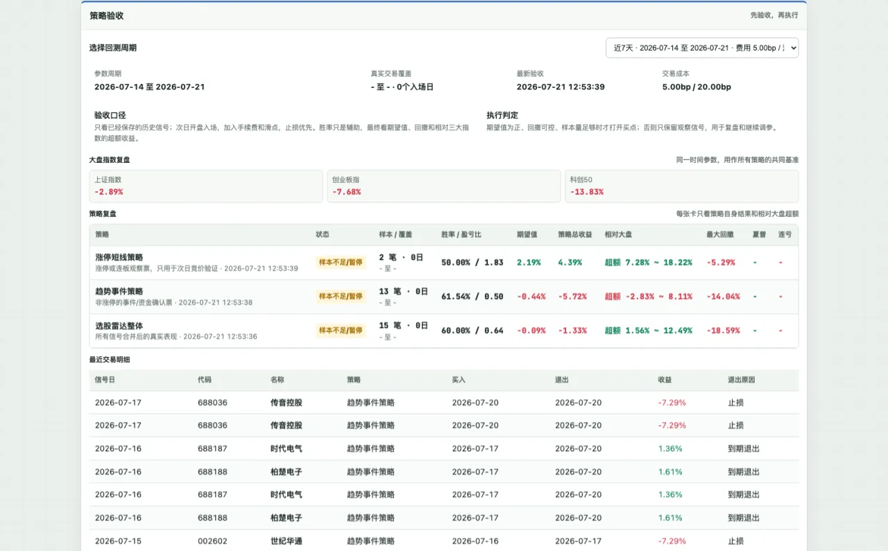
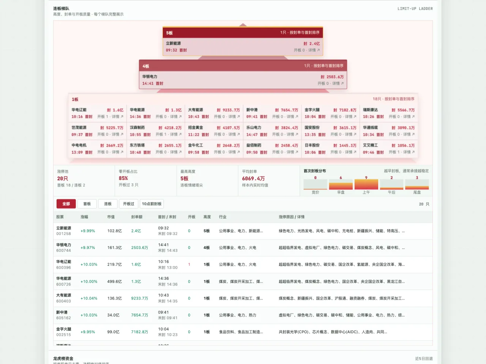

# 📡 StockRadar · 选股雷达实验室


> **A股信号扫描 + 多 Agent 评审 + 策略回测 + VIP 会员系统**。纯 Python → 静态 HTML 管线，Nginx 直接服务。

> ⚠️ **仅供学习研究，不构成投资建议。回测结果不代表未来收益。**

🔗 [在线演示](https://mazhi.icu/invest/stock-lab.html) · [策略说明](docs/STRATEGY.md) · [系统架构](docs/ARCHITECTURE.md) · [技术手册](TECH_DOCS.md)

---

## 🖼️ 效果预览

<div align="center">
  
  <br><sub>📊 大盘资金雷达 — 指数实时涨跌 / 板块主力资金流入 / 涨停梯队 / 情绪周期</sub>
</div>

<br>

<table>
  <tr>
    <td width="50%" align="center">
      
      <br><sub>🤖 信号复盘 — 多 Agent 独立投票，资金/技术/事件/风险闸门通过才进候选</sub>
    </td>
    <td width="50%" align="center">
      
      <br><sub>📈 策略回测 — 胜率/期望值/夏普比率/最大回撤/连亏笔数</sub>
    </td>
  </tr>
  <tr>
    <td colspan="2" align="center">
      
      <br><sub>🔺 涨停梯队金字塔 — 连板高度 / 封单 / 炸板率 / 题材共振</sub>
    </td>
  </tr>
</table>

---

## ✨ 功能

- **选股引擎** (`stock_picker.py`)：动态主题扫描 + 全市场资金动量 + 涨停短线，ThreadPoolExecutor 并行 API 调用
- **信号页面** (`generate_stock_lab.py`)：静态页面生成器，增量生成个股详情页
- **策略回测** (`strategy_backtest.py`)：胜率 / 期望值 / 夏普比率 / 最大回撤 / 最大连亏
- **AI 评审** (`agent_council.py` / `ai_research.py`)：多智能体 consensus + 个股深度研报
- **VIP 账户系统** (`account_server.py` + `manage_users.py`)：注册登录 + 兑换码升级 + 管理后台

[在线演示](https://mazhi.icu/invest/stock-lab.html) · [策略说明](docs/STRATEGY.md) · [系统架构](docs/ARCHITECTURE.md) · [技术手册](TECH_DOCS.md)

## 快速开始

```bash
# 1. 安装依赖
pip3 install flask werkzeug   # 其余用标准库

# 2. 配置密钥（参考 .env.example）
cp .env.example .ai_env
# 填入你的 IWENCAI_API_KEY 等

# 3. 运行选股（--print 只打印不写库）
python3 stock_picker.py --print

# 4. 生成页面
python3 generate_stock_lab.py .

# 5. 启动 VIP 账户服务（端口 5060）
python3 account_server.py
```

## VIP 等级

| 等级 | 可执行买点 |
|------|-----------|
| 普通 | 1 只 |
| VIP | 3 只 |
| 超级VIP | 6 只 |

通过兑换码升级（`manage_users.py generate --tier vip --days 30 --count 10`）。

## 管理工具

```bash
python3 manage_users.py generate --tier svip --days 90 --count 5  # 生成兑换码
python3 manage_users.py list-codes --only-unused                  # 查看可用兑换码
python3 manage_users.py list-users                                 # 查看用户
python3 manage_users.py stats                                      # 统计
```

## 项目结构

```
├── stock_picker.py            # 选股引擎
├── generate_stock_lab.py      # 页面生成器
├── strategy_backtest.py       # 回测系统
├── strategy_filter_search.py  # 策略过滤器
├── agent_council.py           # AI 多智能体评审
├── ai_research.py             # AI 研报生成
├── account_server.py          # VIP 账户服务 (Flask 5060)
├── manage_users.py            # 用户管理 CLI
├── account/
│   ├── login.html             # 登录/注册/账户页
│   └── admin.html             # 管理后台
├── assets/
│   ├── stock-lab.css          # 选股实验室样式
│   ├── stock-lab.js           # 前端渲染逻辑
│   └── invest-terminal.css    # 共享终端样式
├── stock-lab.html             # 选股实验室主页面（生成产物）
├── docs/
│   ├── ARCHITECTURE.md
│   └── STRATEGY.md
├── .env.example               # 环境变量模板
└── .gitignore
```

## 安全

- 所有密钥通过环境变量注入，代码内无硬编码密钥（参考 `.env.example`）
- 密码 scrypt 哈希，Session cookie HttpOnly + Secure
- 兑换码一次性使用，等级到期自动降级
- 数据库 / 日志 / 密钥文件已 gitignore，永不提交

## License

MIT
