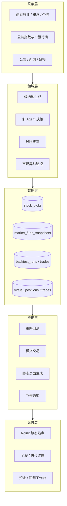
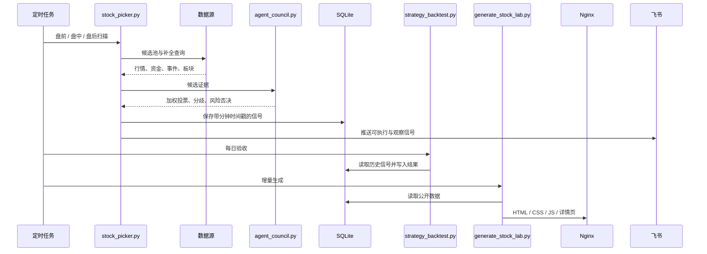
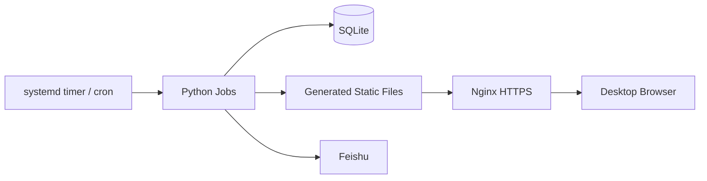

# 系统架构

## 设计目标

系统将数据采集、研究决策、交易执行、效果验证和公开展示分离，避免页面生成逻辑直接决定选股结果，也避免回测修改历史信号。

## 分层结构

## 关键数据流

## 模块职责

| 模块 | 职责 | 不负责 |
|---|---|---|
| `stock_picker.py` | 发现候选、补全数据、生成交易计划 | 修改历史回测结果 |
| `agent_council.py` | 独立观点、加权共识、风险否决 | 调用外部 API |
| `strategy_backtest.py` | 真实规则回放与基准比较 | 重新打分历史信号 |
| `virtual_trader.py` | 模拟账户、T+1、仓位和交易日志 | 用未来数据成交 |
| `generate_stock_lab.py` | 公开数据展示和增量详情生成 | 决定候选是否买入 |
| `market_intraday_monitor.py` | 指数反转与风险提醒 | 高频逐笔交易 |

## 存储边界

SQLite 是当前单机部署的权威数据源。主要表：

- `stock_picks`：信号、批次、时间、评分、交易区间、Agent 元数据。
- `market_fund_snapshots`：指数、板块、涨停、龙虎榜和情绪快照。
- `backtest_runs` / `backtest_trades`：策略级与交易级回测结果。
- `virtual_positions` / `virtual_trades`：模拟持仓与真实交易规则日志。
- `market_intraday_samples` / `market_intraday_alerts`：盘中指数样本与异动。

数据库、密钥和用户数据属于运行态资产，不应进入 Git。

## 部署拓扑

静态优先的部署方式降低了公开页面的运行时依赖；选股和回测失败不会让已生成页面立即不可用。

