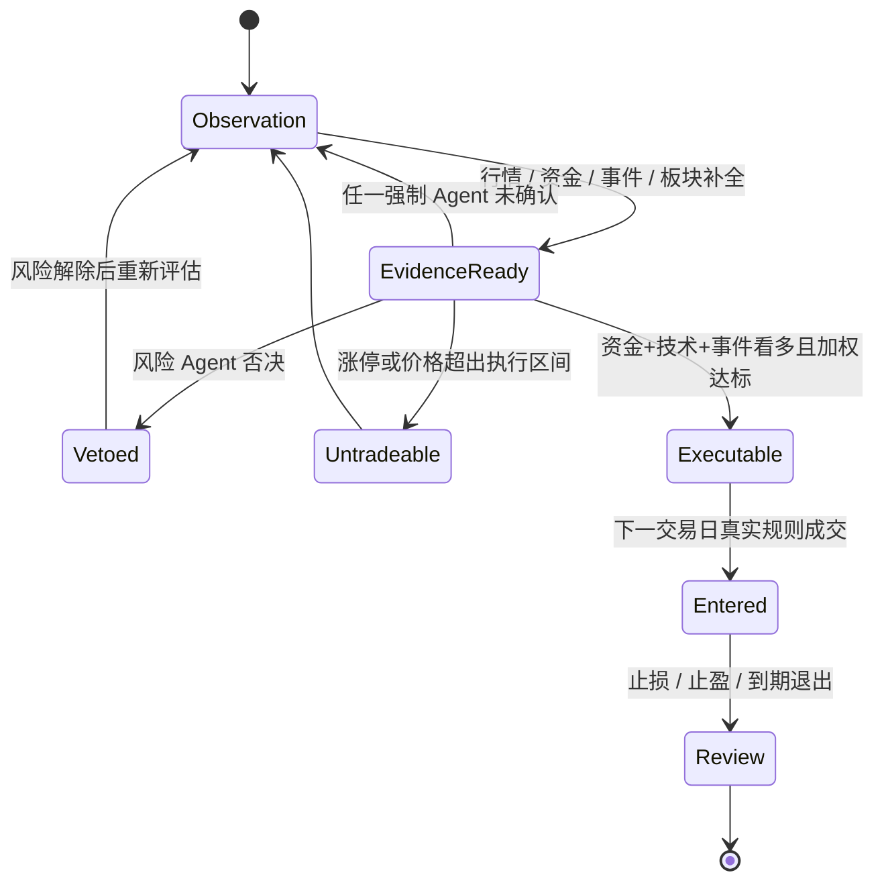
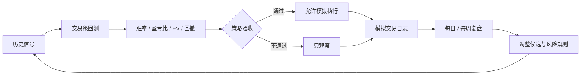

# 策略与风控设计

## 目标

策略不是追求单一高胜率，而是追求扣除成本后的正期望、可控回撤和可真实成交。所有信号必须能够回到当时的时间戳、数据证据和执行规则。

## 候选池

候选来自多个相互补充的入口：

- 动态强势主题与板块资金轮动
- 全市场主力资金确认
- 科创 50 等科技基准池
- 公告、业绩、订单、合作与政策事件
- 核心观察池与历史信号复核
- 涨停梯队观察池（不在涨停当日假设成交）

基础过滤排除 ST、停牌、北交所代码、市值越界和证据严重缺失的标的。

## 多 Agent 决策

每个方向输出 `buy / hold / sell`、置信度和最多四条证据。方向值映射为 `+1 / 0 / -1`：

```text
weighted_score = Σ(weight_i × direction_i × confidence_i)
```

| Agent | 权重 | 看多要求示例 |
|---|---:|---|
| 资金 | 0.30 | A/B 级资金且正向证据不少于负向证据 |
| 技术 | 0.24 | 价格位置合理并有换手或明确量价确认 |
| 事件 | 0.20 | 可核验的新事件，不把机构观点当催化 |
| 板块 | 0.15 | 板块涨幅与板块主力净额共同为正 |
| 质量 | 0.11 | 成长事实与合理估值相互验证 |

风险 Agent 不参与加分。硬风险直接否决，多个软风险也可以升级为否决。

## 买入共识



买入不是简单多数票。即使板块和质量都看多，只要资金、技术或事件任一未确认，信号仍停留在观察池。

## 策略解释层

同一组证据会映射到七类策略，用来解释信号来自哪种市场结构，不重复计算 Agent 权重：

| 策略 | 通过条件摘要 |
|---|---|
| 事件驱动 | 事件 Agent 看多 |
| 资金突破 | 资金与技术同向看多 |
| 热点共振 | 板块与事件同向看多 |
| 成长质量 | 质量 Agent 看多 |
| 涨停龙头 | 涨停当日观察，次日竞价验证 |
| 缩量回踩 | 资金确认且价格处于窄幅回踩区 |
| 情绪周期 | 情绪适中；过冷或过热不通过 |

## 风险闸门

### 硬风险

- 监管、立案或处罚
- 减持、解禁
- 业绩预亏或业绩变脸
- 明确舆情利空
- 策略样本不足或趋势熔断

### 软风险

- 股权质押、高估值或估值异常
- 主力资金流出、龙虎榜机构卖出
- 技术破位、价格偏离执行区间
- 涨停不可成交

一个硬风险直接否决；多个软风险可以联合否决。风险否决不会删除信号，而是保留为观察样本供后续复盘。

## 涨停梯队

涨停数据只用于市场情绪和次日竞价验证：

- 最高连板位于金字塔顶部，一板位于底部。
- 每个梯队完整显示，不用前五名截断。
- 同层先按封单金额降序，再按首次封板时间升序。
- 展示首次封板时间和开板次数，区分稳定封板与反复炸板。
- 当日涨停或接近涨停不生成买点。

## A 股回测规则

- 信号日不成交，默认下一交易日入场。
- 遵循 T+1，当日买入不能当日卖出。
- 同一天同时触发止损和止盈时，止损优先，避免乐观偏差。
- 扣除手续费和滑点。
- 同日同标的重复信号去重。
- 使用同周期上证指数、创业板指、科创 50 计算超额收益。
- 样本量不足、期望值非正或回撤超限时暂停执行。

## 反馈闭环



策略参数调整必须保留样本外验证区间，不能为了达到某个胜率目标反复拟合全部历史数据。

